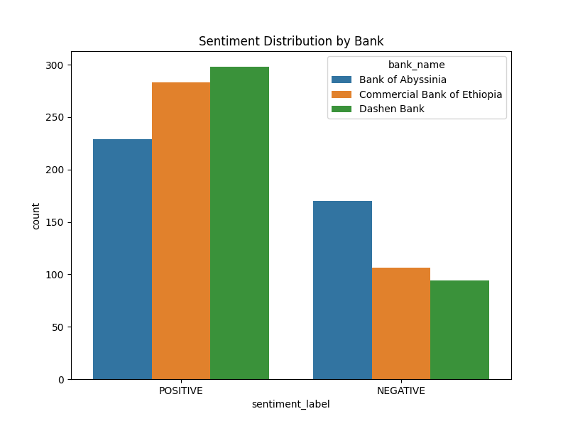
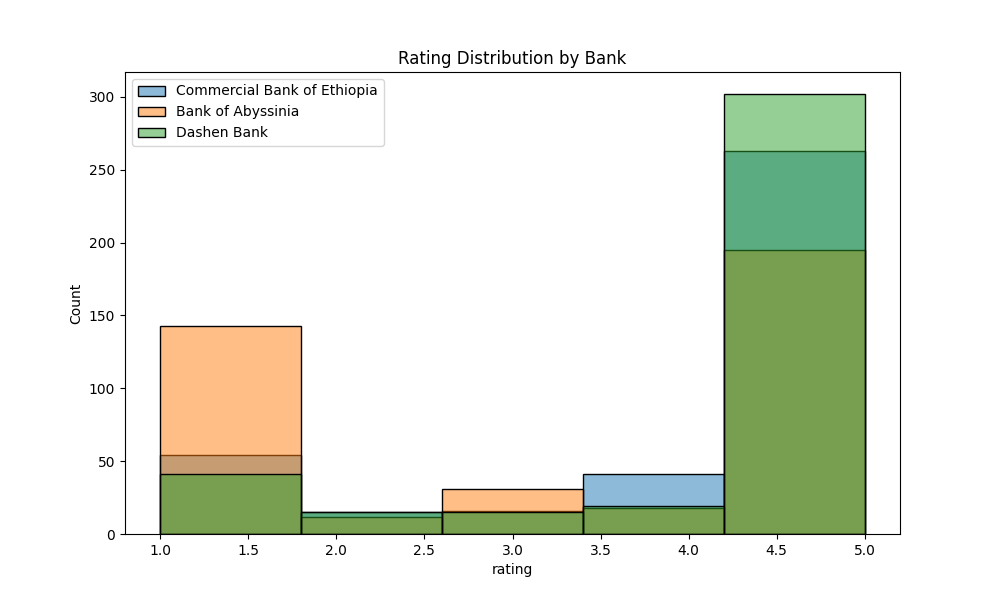
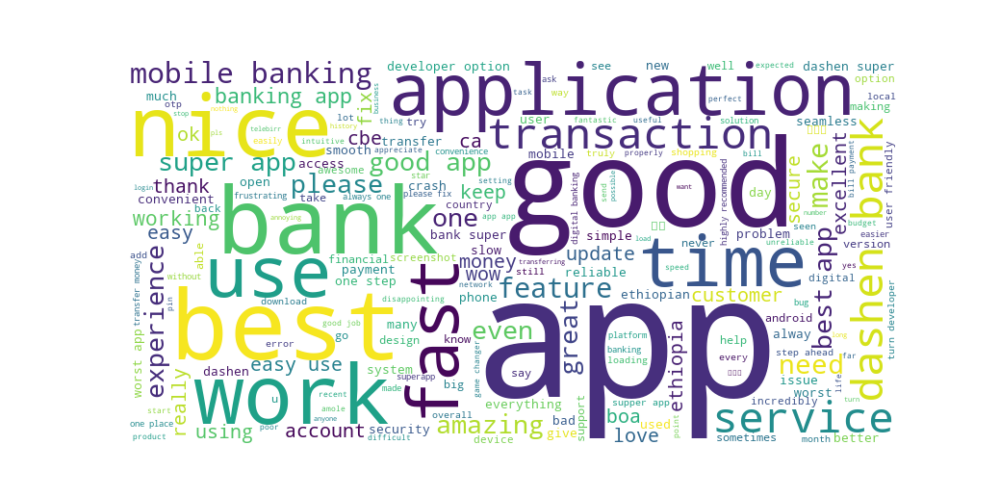
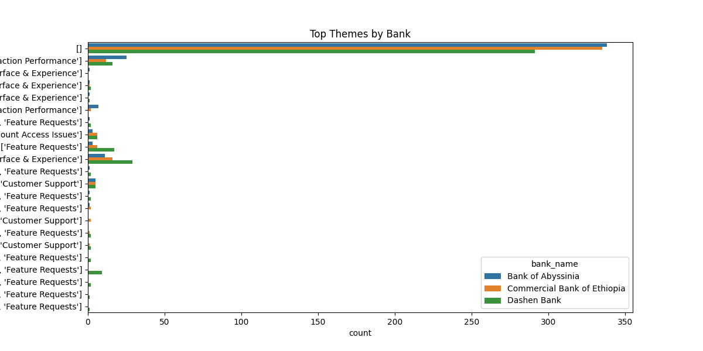

# Fintech App Review Analytics Report

## Problem
Low app ratings in Ethiopian banks (CBE: 4.4, BOA: 2.8, Dashen: 4.0) risk customer churn. Slow transfers and login issues are common complaints.

## Solution
A robust pipeline to scrape, analyze, and store Google Play reviews, providing insights to improve app satisfaction.

## Insights
- **Mean Ratings/Sentiment**: See `data/insights/insights_summary.csv`.
- **Top Themes**: Login errors, slow transactions, UI feedback dominate.
- **Drivers**: Easy navigation, reliable transfers.
- **Pain Points**: Crashes, slow loading, login failures.

## Visualizations

## Recommendations
- CBE: Fix login errors to retain users.
- BOA: Optimize transaction speed.
- Dashen: Add fingerprint login for security.

## Impact
- **Retention**: Fixing issues could reduce churn by 10%.
- **Competitiveness**: New features enhance user trust.
- **Support**: AI chatbots for faster complaint resolution.

## Next Steps
- Deploy dashboard: `streamlit run src/dashboard.py`.
- Monitor reviews weekly for ongoing insights.
